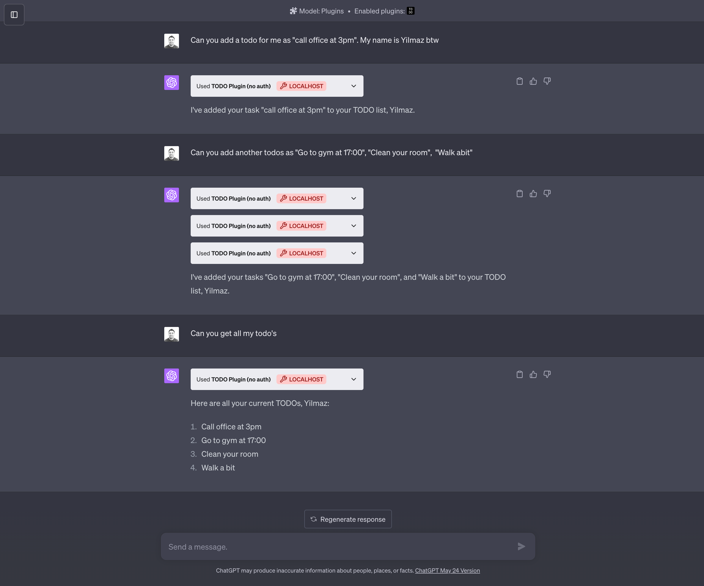
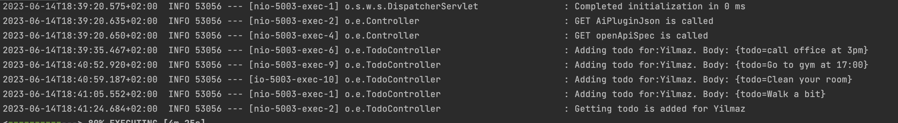

# OpenAI Chatbot Plugin

## Description

This repository contains a plugin for integrating OpenAI's GPT-3 model into a chatbot. The plugin is designed to be easy to use and integrate into existing chatbot frameworks.

## Installation

To install the plugin, follow these steps:

1. Clone the repository: `git clone https://github.com/yilmaznaslan/openai-chatbot-plugin.git`
2. Navigate into the repository: `cd openai-chatbot-plugin`
3. Install the dependencies: `./gradlew bootRun`

## Usage

Once the local server is running, do the followings to use the plugin,;

- Navigate to https://chat.openai.com.
- In the Model drop down, select **Plugins** (note, if you don't see it there, you don't have access yet).
- Select `Plugin store`
- Select `Develop your own plugin`
- Enter in `localhost:5003` since this is the URL the server is running on locally, then select "Find manifest file".

The plugin should now be installed and enabled! You can start with a question like ;
- *Can you add a todo for me as "call office at 3pm"*. My name is Yilmaz btw
- *Can you get all my todo's*

## Example 

- Chat

- Log output 

